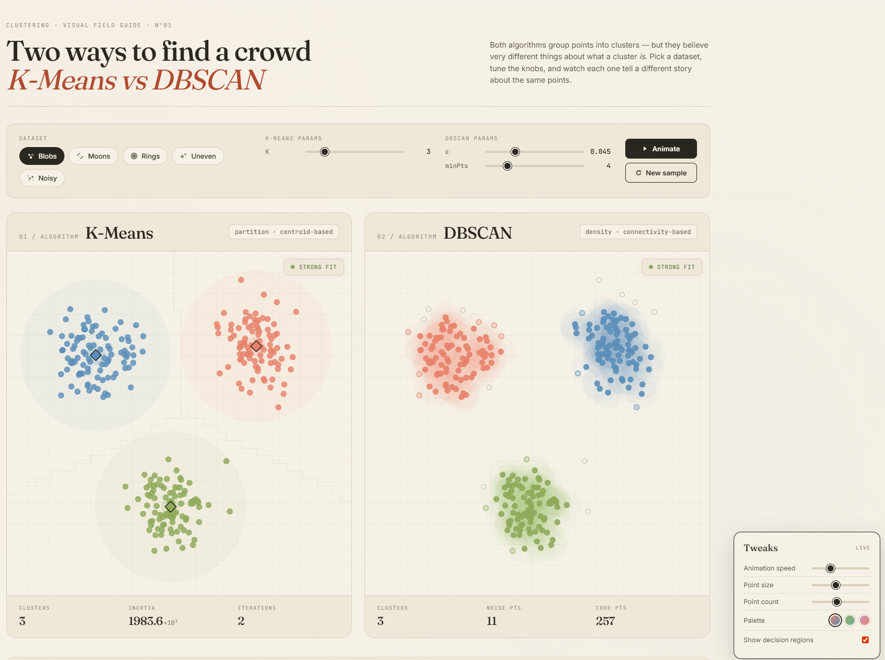

## Live Demo
https://nino-11.github.io/kmeans-vs-dbscan/

An interactive visualization that builds intuition for how K-Means and DBSCAN behave on real-world, non-linear data.

## Why this matters

Clustering is often taught in theory, but real-world data rarely follows clean, spherical distributions.

This project highlights:
- Why K-Means struggles with non-linear shapes
- How DBSCAN detects arbitrary clusters and noise
- The importance of choosing the right algorithm for the data
